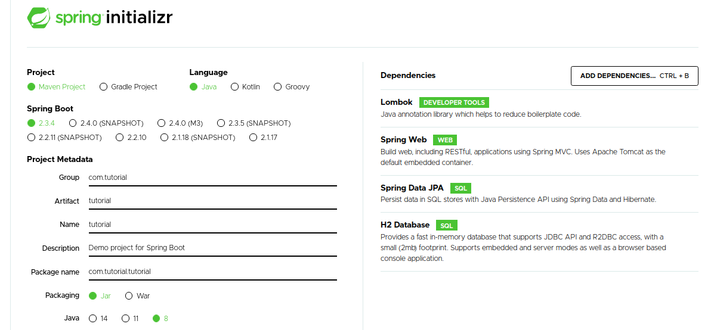
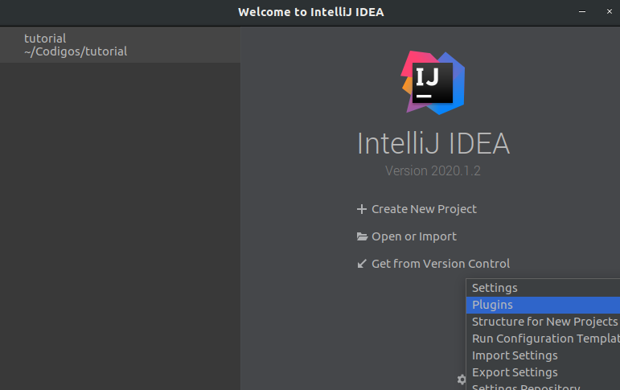
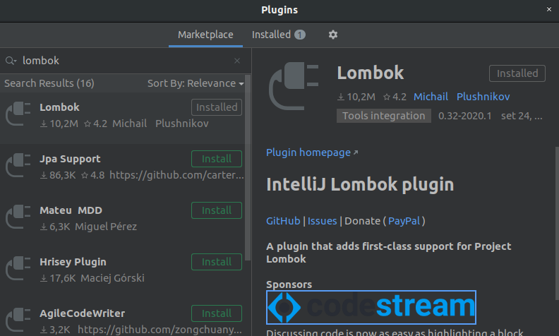

#TUTORIAL EM ANDAMENTO 
# Tutorial para iniciantes em Spring Boot

## Configurando o ambiente Java no Ubuntu

### Instalando o Java
```
sudo apt install openjdk-11-jdk
sudo apt install openjdk-11-jre
```

### Verificando a versão do Java
```
java -version
```

### Verificando e alterando a versão do Java instalado
```
sudo update-alternatives --config java
```

### Adicionando a variável de ambiente JAVA_HOME
```
sudo nano /etc/environment
```
Ao abrir o editor Nano, adicione ao final do arquivo a seguinte linha:

```
JAVA_HOME="/usr/lib/jvm/java-11-openjdk-amd64/bin/"
```

Reinicie o terminal e digite:
```
echo $JAVA_HOME
```
Caso a saída seja "/"usr/lib/jvm/java-11-openjdk-amd64/bin/" a instalação foi feita corretamente.

## Iniciando o projeto em Spring Boot
Entre em https://start.spring.io/ para criar um projeto com as seguintes configurações: 


Abra o IntelliJ e adicione o plugin Lombok para redução de boilerplate



## Adicionando o banco de dados H2

Em src/main/resources/application.properties adicione:
```
spring.datasource.url=jdbc:h2:mem:TEST;DB_CLOSE_DELAY=-1;
spring.datasource.username=sa
spring.datasource.password=
spring.datasource.driver-class-name=org.h2.Driver
spring.datasource.platform=h2
spring.jpa.hibernate.ddl-auto=none
spring.jpa.properties.hibernate.dialect=org.hibernate.dialect.H2Dialect
spring.h2.console.enabled=true
```
No terminal de execução verifique a linha 
```
[           main] o.s.b.a.h2.H2ConsoleAutoConfiguration    : H2 console available at '/h2-console'. Database available at 'jdbc:h2:mem:TEST'
```
copie a trecho entre aspas, no caso do exemplo é:
'jdbc:h2:mem:TEST'

Acessando o console do banco em http://localhost:8080/h2-console, adicione:
- usuário: "sa"
- senha: deixe em branco
- JDBC URL: 'jdbc:h2:mem:TEST'

## Adicionando um Model

```
@Entity
@Table(name="TB_PRODUTO")
@AllArgsConstructor
@NoArgsConstructor
@Setter
@Getter
public class Documento {
    @Id
    @GeneratedValue(strategy= GenerationType.AUTO)
    private Integer id;
    private String titulo;
    private String autor;

    public Documento(String titulo, String autor) {
        this.titulo = titulo;
        this.autor = autor;
    }
}
```

## Adicionando um Repository

## Adicionando um Controller